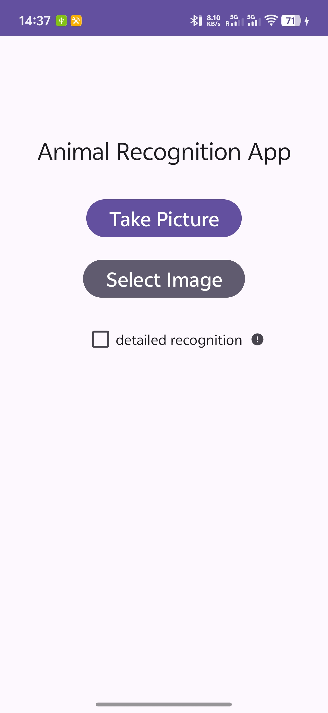
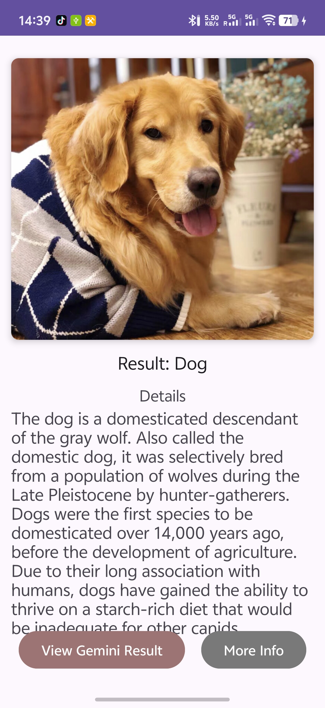
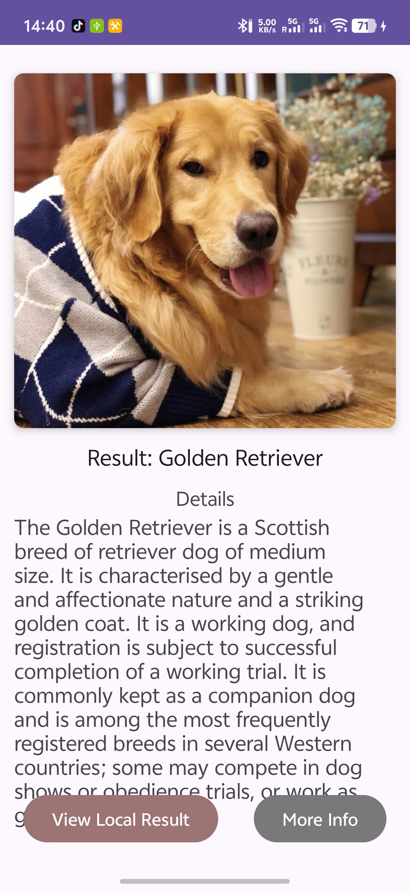
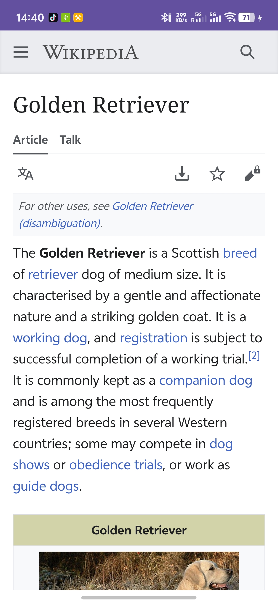

# Animal Classification AI App

This Android application is an advanced prototype demonstrating a **hybrid AI approach** to animal classification. It strategically combines fast, on-device inference using **ONNX Runtime** with the powerful, multimodal capabilities of the **Google Gemini Cloud API**.

This architecture allows the user to get an instant, offline-capable identification and then request a more powerful second opinion from a state-of-the-art cloud AI, directly comparing the results.

## Screenshots
<table>
  <tr>
    <td width="50%">
      
      
<em>Main screen where user can select camera or gallery</em>

    </td>
    <td width="50%">
      
      
<em>Result screen showing the image and the local ONNX model's prediction</em>

    </td>
  </tr>
  <tr>
    <td width="50%">
      
      
<em>Result screen showing the Gemini API's prediction</em>

    </td>
    <td width="50%">
      
      
<em>WebView activity displaying the Wikipedia page for the animal</em>

    </td>
  </tr>
</table>

## Features

- **Dual Image Input:** Select images from the device gallery or capture a new one using the camera.
- **On-Device Classification (ONNX):**
    - Employs a **two-stage local inference process**:
        1. **General Model:** First, it uses `animal_recognition_model_90animals.onnx` for **fast, offline, coarse-grained recognition** across 90 different animal species.
        2. **Detailed Model:** If the "Detailed Recognition" option is enabled *and* the first model identifies a cat or dog, it then runs a second, specialized model (`animal_recognition_model_dog_cat.onnx`) for **fine-grained breed identification**.
- **Cloud Classification (Gemini):**
    - Integrates Google's `gemini-2.5-flash` model for **high-accuracy, multimodal (image + text prompt) recognition**.
    - Provides a powerful alternative result to the local models.
- **Dynamic Information:**
    - Automatically fetches a text summary for the recognized animal from the **Wikipedia REST API**.
    - Allows users to **toggle between the local (ONNX) result and the remote (Gemini) result** for direct comparison.
- **Detailed Web View:** A "Detail Page" button opens the full Wikipedia page for the animal within the app using a `WebView`.

## Key Architectural Highlights

This project was not just about building an app, but about **prototyping and evaluating** different technical solutions, demonstrating skills relevant to modern mobile and human-computer interaction research.

- **Hybrid AI Architecture:** The app intelligently combines two different ML approaches. This **evaluates the trade-offs** between on-device (fast, private, offline) and cloud-based (more powerful, flexible, requires network) inference.
- **Multi-Stage On-Device ML (ONNX Runtime):** The use of *two* chained ONNX models demonstrates a more complex and efficient on-device strategy. A lightweight "gate" model (90 species) runs first, and only if necessary, a more specialized model (cat/dog breeds) is activated. This pattern is essential for **mobile, edge, and wearable applications** (e.g., Smart Glasses, IoT devices) as it optimizes performance and battery life by avoiding unnecessary computation.
- **State-of-the-Art Cloud AI (Gemini):** Integration with the Gemini API shows proficiency with cutting-edge, multimodal AI services and modern REST API consumption.
- **Modern Android Prototyping:** The project is built with 100% Kotlin and uses modern Android components to create a robust and maintanable prototype:
    - **Kotlin Coroutines** for clean, efficient asynchronous code (handling network requests and ML inference).
    - **ViewBinding** for null-safe and type-safe UI interaction.
    - **`ActivityResultContracts`** as the modern, type-safe standard for handling permissions and image retrieval.

## How It Works: Application Flow

1. **Main Screen (`MainActivity`):**
    - The user chooses an image source (camera or gallery) and sets the "Enable Detailed Recognition" option.
    - Modern `ActivityResultContracts` handle permissions and image retrieval.
    - The selected image `Uri` and the `enableDetailed` boolean are passed to the `ResultActivity`.
2. **Result & Processing (`ResultActivity`):**
    - **Local (ONNX) Inference:** The app first processes the image locally.
        - The image is preprocessed (224x224, normalized) and fed into the **general 90-species ONNX model**.
        - If detailed mode is on (and a cat/dog is found), the image is then fed into the **specialized cat/dog breed ONNX model**.
        - The Wikipedia API is called via `WikiIntroClient` to fetch a summary for this final local result.
        - The local result is displayed to the user first.
    - **Remote (Gemini) Inference (Optional):**
        - If the user clicks "View Gemini Result," the app triggers `fetchGeminiResult()`.
        - The image is encoded to Base64 and sent to the Google Gemini API along with a text prompt.
        - The API's text response (animal name) is parsed.
        - The Wikipedia API is called *again* to fetch the summary for this new result.
    - **Toggle UI:** The UI updates, and the user can now toggle between the two results.
3. **Info Page (`InfoActivity`):**
    - A simple `WebView` activity that loads the animal's Wikipedia URL, showing a progress bar during load.

## Technology Stack

- **Language:** 100% **Kotlin**
- **Core Architecture:** Android SDK, Activities, **ViewBinding**
- **Asynchronous:** **Kotlin Coroutines** (`lifecycleScope`, `withContext`)
- **On-Device ML:** **ONNX Runtime (ORT) for Android**
- **Networking:** **Retrofit 2** & **OkHttp 3** (for type-safe API calls)
- **JSON Parsing:** **Gson**
- **Cloud & Web APIs:**
    - **Google Gemini API** (Multimodal AI)
    - **Wikipedia REST API** (Page summaries)
- **Modern Android:**
    - `ActivityResultContracts` (Permissions & Image Picking)
    - `FileProvider` (Secure camera photo handling)

## Setup & Configuration

To build and run this project, you will need:

1. **Google Gemini API Key:**
    - Obtain an API key from [Google AI Studio](https://www.google.com/search?q=https://ai.google.dev/makersuite).
    - Place the key in your `local.properties` file:Properties
        
        `GEMINI_API_KEY="YOUR_API_KEY_HERE"`
        
2. **ONNX Models & Labels:**
    - Place the following files in your `src/main/assets` directory:
        - `animal_recognition_model_90animals.onnx`
        - `labels_90animals.json`
        - `animal_recognition_model_dog_cat.onnx`
        - `labels_dog_cat.json`